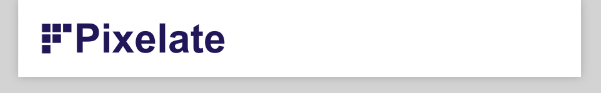
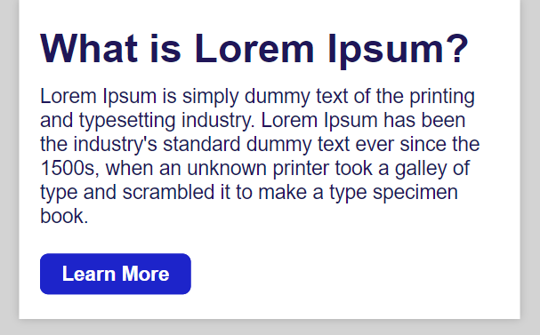
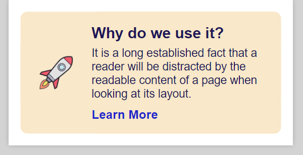
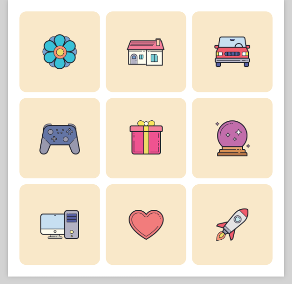

# Project Pixelate

This project was created by me as part of my effort to learn email development using HTML and CSS. It is a collection of different modules that can be combined to create an email. The modules have been tested in handful of clients and I have managed to solve some of the rendering issues.

## Header

## Primary

## Banner

## Rectangle

## Grid 9

